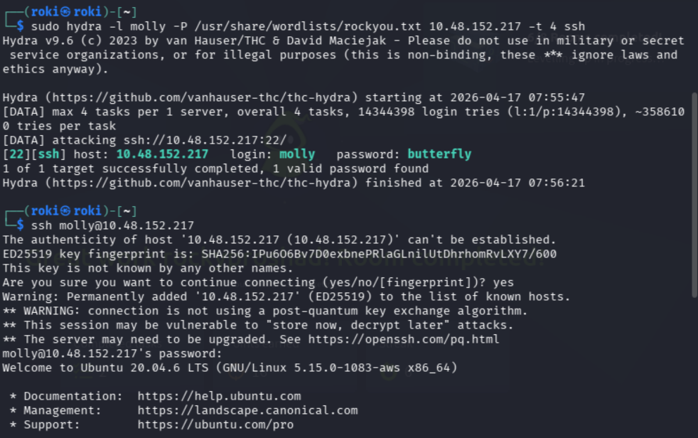
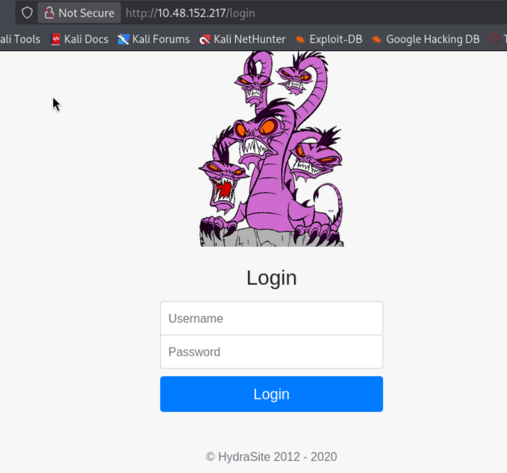
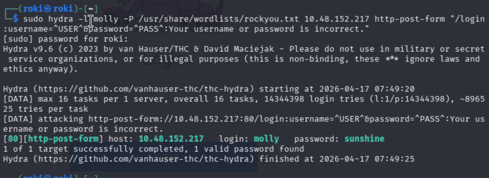
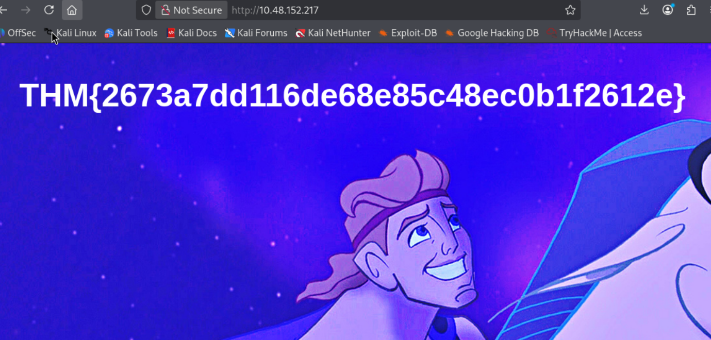
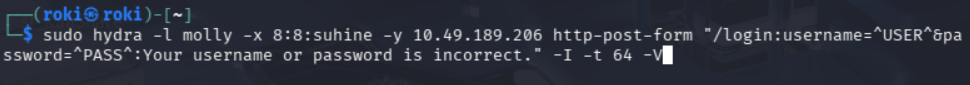
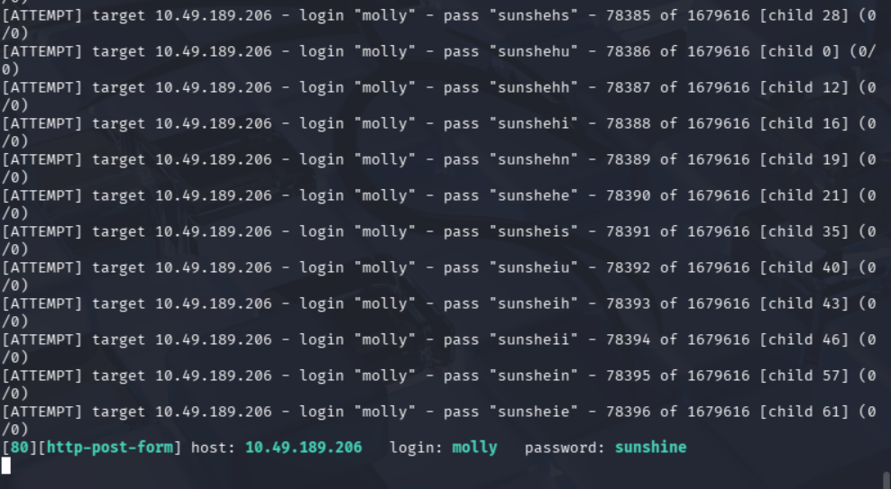

# Password Attacks and Brute Force Attack

## Goal of Today

- Understand how attackers guess passwords
- Identify brute force attacks in logs
- Explain password attacks like a SOC analyst
- Detect suspicious login behavior

## Password Attack?
A password attack is a method used by attackers to:
- Guess user credentials
- Exploit weak passwords
- Gain unauthorized access to systems  

These attacks are often used after phishing or as a direct method of intrusion.

## Types of Password Attacks
- Brute Force Attack
- Dictionary Attack
- Credential Stuffing
- Password Spraying

### Brute Force Attack
An attack where all possible password combinations are attempted until the correct one is found.

#### Key Characteristics:
- High number of login attempts
- Automated tools used
- Targets a single account

#### Example Scenario:
An attacker repeatedly tries different passwords on an admin account until access is granted.

#### SOC Indicators:
- Multiple failed login attempts
- Same IP address targeting one account
- Rapid login attempts in short time

### Dictionary Attack
An attack that uses a predefined list of common passwords.(rockyou.txt)

#### Key Characteristics:
- Faster than brute force
- Uses common password lists
- Targets weak passwords

#### SOC Indicators:
- Repeated login attempts using common password patterns
- Similar failure logs across attempts
- Same IP address targeting one account

### Credential Stuffing
Using previously leaked username/password combinations from *data breaches* to gain access.

#### Key Characteristics:
- Uses real credentials
- Targets multiple accounts
- **High success rate if passwords are reused**

**Example Scenario**:
Credentials leaked from one platform are used to log into another.

#### SOC Indicators:
- Multiple login attempts across accounts
- Successful login after few attempts
- Logins from unusual locations

### Password Spraying
An attack where a single password is tried across multiple accounts.

#### Key Characteristics:
- Avoids account lockouts
- Targets many users
- Uses common passwords

**Example Scenario**:
Trying *Welcome123* across multiple employee accounts.

#### SOC Indicators:
- One IP targeting many usernames
- Few attempts per account
- Distributed login failures

## SOC Analyst Perspective
SOC analysts detect password attacks by analyzing patterns in authentication logs.

### Key Investigation Questions
- How many login attempts occurred
- Are multiple users targeted
- Is the same IP address involved
- Was there a successful login

### Indicators of Compromise (IOCs)
- Multiple failed login attempts
- Login attempts from a single IP
- Sudden successful login after failures
- Logins from unusual locations

### Detection Logic
- Many attempts, one user, common password => Dictionary Attack
- Many attempts, one user, diffetent password => Brute Force
- Many users, one password => Password Spraying
- Known credentials reused => Credential Stuffing

### Response Actions (Immediate):
- Lock affected account
- Block suspicious IP address
- Alert security team

### Response Actions (Follow-up):
- Enforce password reset
- Enable multi-factor authentication (MFA)
- Monitor for further suspicious activity

## Practical Learning

### TryHackMe Room: Hydra
- How easily a weak password can be cracked
- How to write Hydra commands for dictionary and brute force attack
- How to attack an SSH server to crack password using Dictionary attack and Brute force attack
- How to attack an HTTP-Post-Form

#### Screenshots from room

**SSH Dictionary attack login using Hydra**  

   

**HTTP-POST-FORM**  

   

**HTTP-POST-FORM Dictionary Attack using Hydra**  

 

   

**HTTP-POST-FORM Brute force attack using Hydra**  

